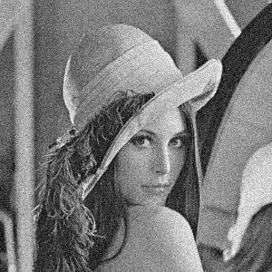
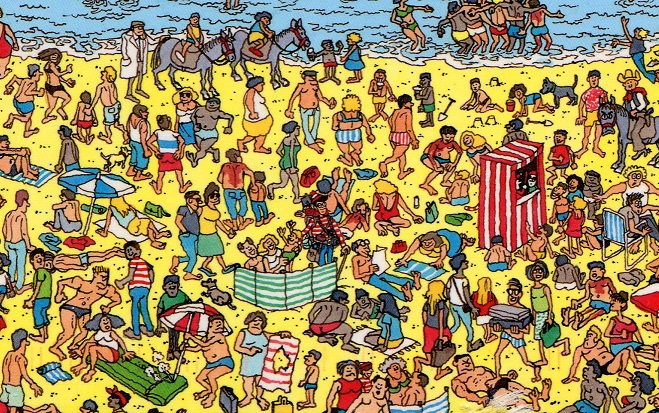

## Image denoising(que1.m)
Use "leena_noisy.jpg" for the experiment.

Generate gaussian filters and apply it on the image using various sigma values.
 
## Template matching(que2.m)
### Template "where-is-waldo.jpg"

### Target image "waldo.jpg"

Find the location of the target image in template image using normalized cross correlation

## Sobel edge detection(que3.m)
Use sobel kernels to find the edges of an image.
### Test image

If possible write your own code for convolution and correlation
